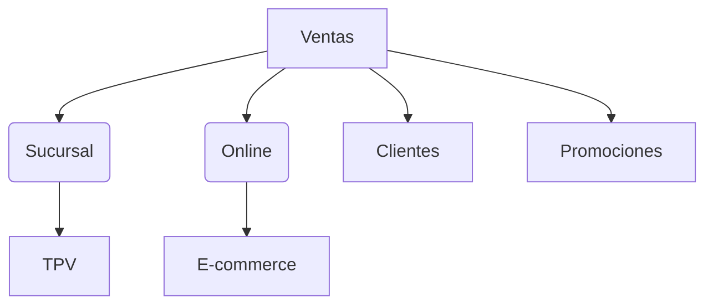
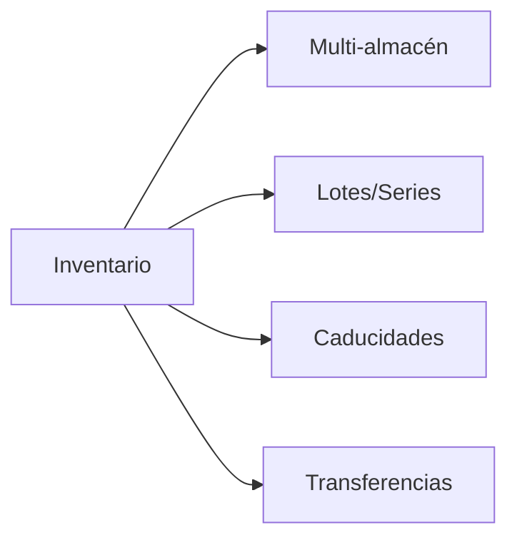
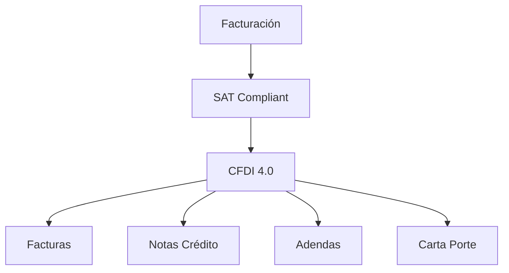
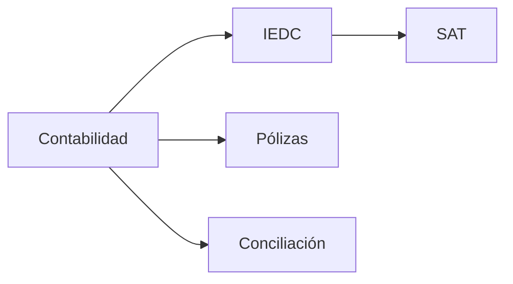
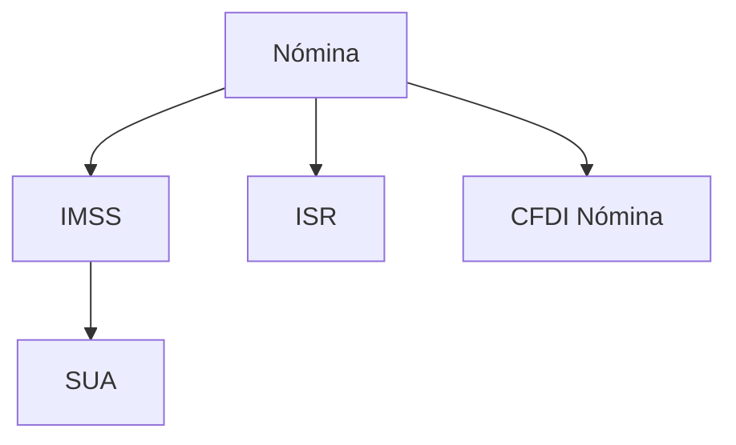
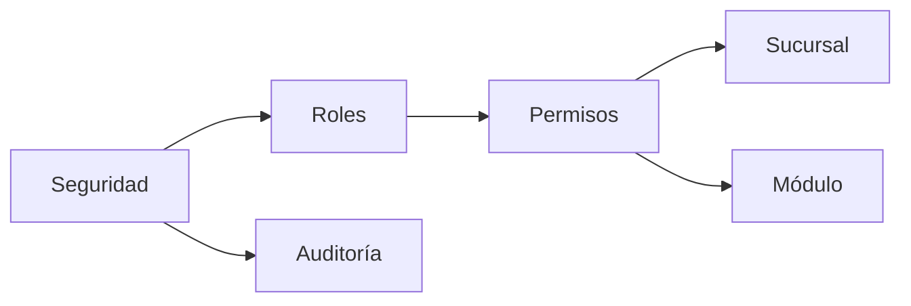
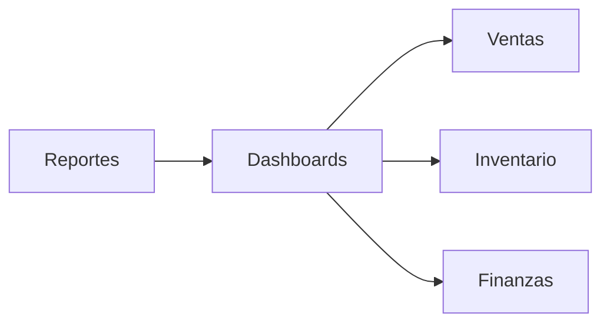
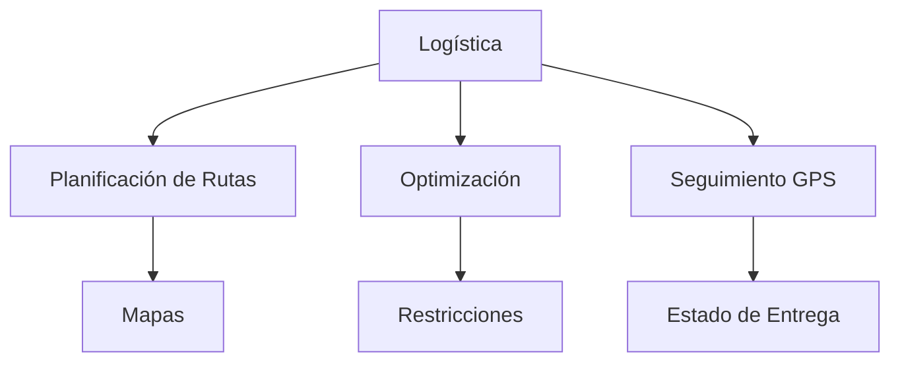

# Sistema ERP Integral para Empresas Mexicanas


Solución ERP integral para gestión empresarial con funcionalidades específicas para el mercado mexicano, incluyendo facturación digital CFDI 4.0, nómina y contabilidad electrónica.

```mermaid
  graph TD
    ERP[ERP Central]
  
    %% Módulo: Gestión de Usuarios y Seguridad
    ERP --> UsuariosSeguridad[Gestión de Usuarios y Seguridad]
    UsuariosSeguridad --> Login[Registro e Inicio de sesión]
    UsuariosSeguridad --> Accesos[Control de accesos y perfiles]
    UsuariosSeguridad --> Logs[Bitácora de actividades]
    UsuariosSeguridad --> Seguridad2FA[Autenticación 2FA]
  
    %% Módulo: Clientes y CRM
    ERP --> CRM[Clientes y CRM]
    CRM --> RegClientes[Registro y seguimiento de clientes]
    CRM --> Tareas[Tareas y recordatorios]
    CRM --> SeguimientoCRM[Historial de contacto y seguimiento]
    CRM --> Oportunidades[Gestión de oportunidades]
  
    %% Módulo: Productos y Servicios
    ERP --> Productos[Productos y Servicios]
    Productos --> Catalogo[Catálogo de productos y servicios]
    Productos --> Clasificacion[Clasificación por categorías y atributos]
    Productos --> Precios[Precios, descuentos y listas de precios]
    Productos --> Servicios[Gestión de servicios]
  
    %% Módulo: Inventario y Almacenes
    ERP --> Inventario[Inventario y Almacenes]
    Inventario --> Stock[Control de stock]
    Inventario --> EntradasSalidas[Entradas y salidas]
    Inventario --> Transferencias[Transferencias entre almacenes]
    Inventario --> Ajustes[Ajustes e inventarios físicos]
  
    %% Módulo: Ventas
    ERP --> Ventas[Ventas]
    Ventas --> Cotizaciones
    Ventas --> OrdenesVenta[Órdenes de venta]
    Ventas --> Devoluciones[Devoluciones y notas de crédito]
  
    %% Módulo: Compras
    ERP --> Compras
    Compras --> Solicitudes[Solicitudes de compra]
    Compras --> OrdenesCompra[Órdenes de compra]
    Compras --> Recepciones[Recepciones y devoluciones]
    Compras --> Proveedores
  
    %% Módulo: Punto de Venta (POS)
    ERP --> POS[Punto de Venta (POS)]
    POS --> Caja[Caja y terminal]
    POS --> Tickets[Gestión de tickets y facturas]
    POS --> Cierres[Apertura y cierre de caja]
  
    %% Módulo: Contabilidad y Finanzas
    ERP --> Contabilidad
    Contabilidad --> Cuentas[Catálogo de cuentas]
    Contabilidad --> Diario[Diario contable]
    Contabilidad --> CxC[Cuentas por cobrar/pagar]
    Contabilidad --> Conciliaciones[Conciliaciones bancarias]
  
    %% Módulo: Recursos Humanos
    ERP --> RRHH[Recursos Humanos]
    RRHH --> Empleados
    RRHH --> Nomina[Nómina]
    RRHH --> Asistencias[Asistencias y ausencias]
    RRHH --> Evaluaciones
    RRHH --> Contratos
  
    %% Módulo: Reportes y Análisis
    ERP --> Reportes
    Reportes --> Dashboard
    Reportes --> ReportesModulo[Reportes por módulo]
    Reportes --> Personalizados[Reportes personalizados]
    Reportes --> Exportacion[Exportación a Excel/PDF]
  
    %% Módulo: Configuración del Sistema
    ERP --> Configuracion
    Configuracion --> Empresa[Datos de la empresa]
    Configuracion --> Impuestos
    Configuracion --> Plantillas[Plantillas de documentos]
    Configuracion --> Integraciones[Integraciones externas]
```

## Módulos Principales

### 1. 📊 Ventas y CRM

-   Gestión multicanal: Ventas físicas (TPV) y online integradas
-   CRM básico: Historial de clientes, segmentación, tracking

-   Promociones: Descuentos por producto/cliente/volumen

-   Pedidos: Backorders, preórdenes, devoluciones

-   Integración e-commerce: Pasarelas de pago, gestión de envíos
### 2. 📦 Almacén e Inventario

-   Control de múltiples almacenes/sucursales

-   Gestión de inventario en tiempo real

-   Métodos de costeo (PEPS, UEPS, Promedio)

-   Rastreo de lotes y series

-   Transferencias entre sucursales

-   Conteos cíclicos e inventarios físicos

### 3. 📑 Facturación Electrónica (CFDI 4.0)

Emisión y timbrado con PAC

Complementos especiales (Comercio Exterior, Pagos)

Manejo de adendas para información adicional

Cancelación vía acuse/sustitución

Generación automática de PDF

Carta Porte para transporte

### 4. 🧾 Contabilidad Electrónica


Contabilidad general (diario, mayor, balances)

Generación automática de IEDC en XML

Complemento de pagos

Declaraciones informativas (DIOT)

Conciliación bancaria automática

Reportes fiscales (IVA, ISR)

### 5. 👥 Nómina Mexicana



Cálculo de percepciones y deducciones (LISR, LSS)

Generación de CFDI de nómina

Manejo de incidencias (vacaciones, PTU)

Procesos IMSS (SUA, IDSE)

Dispersión bancaria (SPEI)

Acumulados anuales para declaraciones

### 6. 🔐 Seguridad y Administración



Roles jerárquicos por sucursal/departamento

Permisos granulares (lectura, escritura, aprobación)

Restricción por niveles organizacionales

Auditoría de operaciones y cambios

Administración centralizada de usuarios

### 7. 📈 Reportes y BI


Dashboards interactivos personalizables

Reportes operativos (ventas, inventario)

Reportes financieros (balance, estado de resultados)

Análisis de margen y rentabilidad

Exportación a Excel/PDF

Indicadores KPI por sucursal

### 8. 🚚 Logística y Optimización de Rutas

- **Gestión de flota**: Vehículos, conductores, mantenimiento

- **Planificación inteligente**: Rutas optimizadas por distancia, tiempo y costo

- **Optimización en tiempo real**: Replanificación por tráfico o imprevistos

- **Seguimiento GPS**: Monitoreo de flota en tiempo real

- **Notificaciones**: Alertas a clientes sobre estado de entrega

- **KPIs de desempeño**: Tiempos de entrega, costos logísticos

## Requisitos Técnicos
- Componente	Versión
- Servidor	Ubuntu 20.04+
- Base de datos ó Mogodb ó HSDB ó **PostgreSQL 12+***
- Backend	Node.js 20+
- Frontend	React 20+
- SAT	CFDI 4.0
- PAC	Certificado
